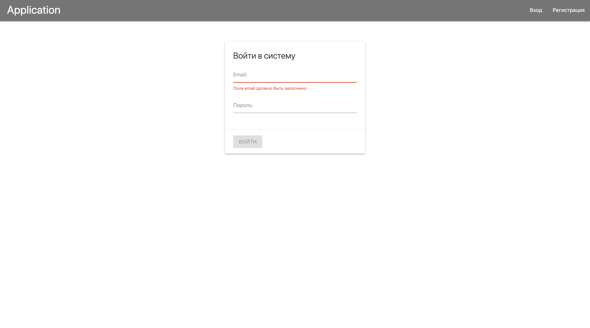
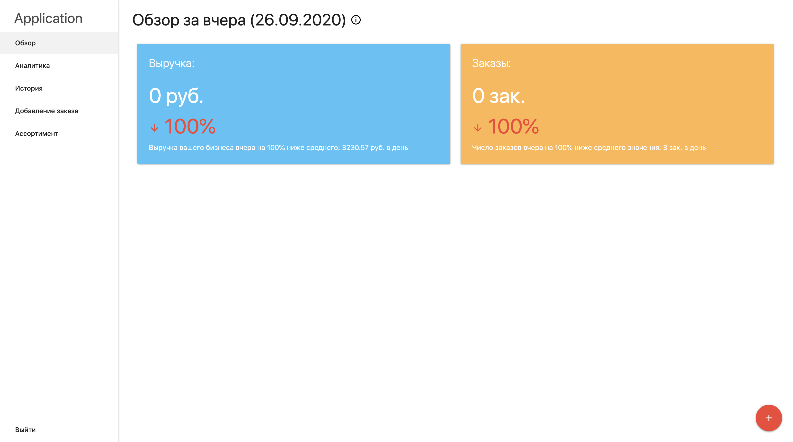
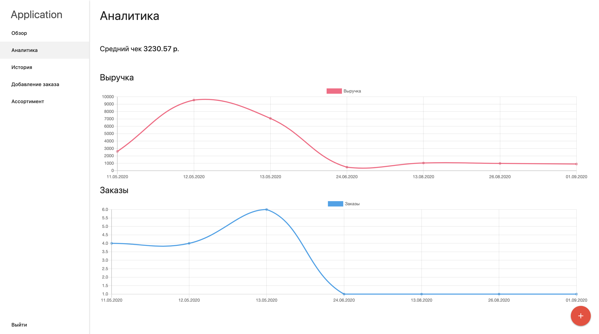
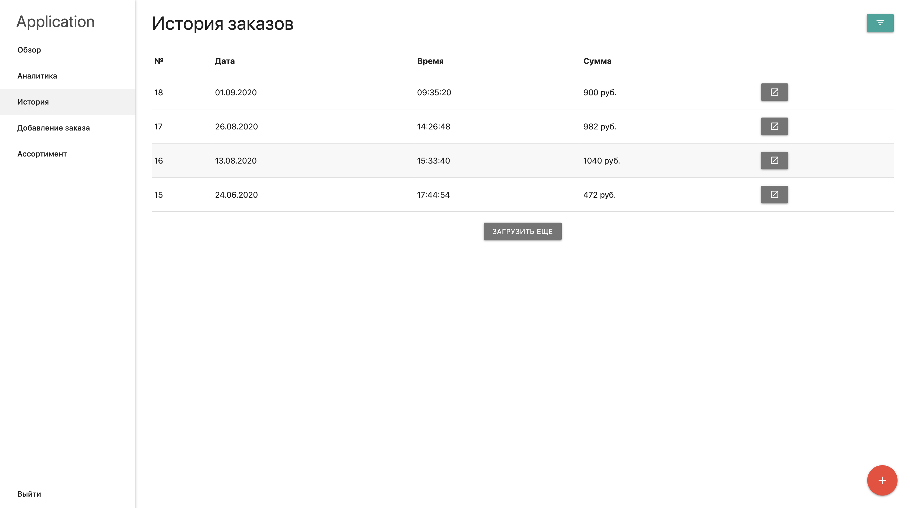
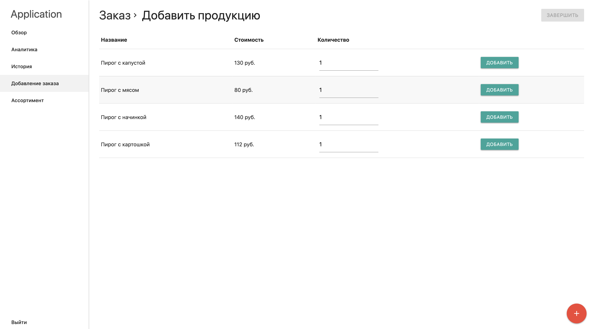

# FullStack App with Angular and Express

##Приложение для контроля заказов и выручки. [Ссылка на приложение](https://immense-gorge-28013.herokuapp.com/)

###Описание:

Приложение по контролю заказов, их истории. Также есть аналитика для получения информации в виде графиков: о доходах и о количестве заказов 

#### Вид приложения: 

### Технологии:
1. Angular
2. Express
3. MongoDB
4. JWT

### Мотивация

Желание поработать с Angular и написать свой REST api сервер на express
, а также разбраться с технологией jsonwebtoken

